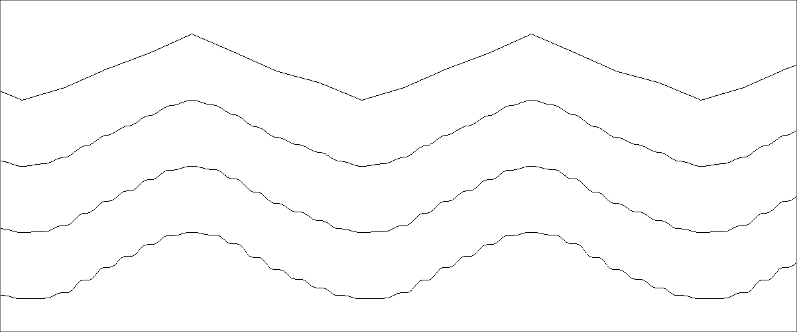

# Interpolation formula finder

Find coefficients for the formula which first, second and third derivatives are equal zero in its endpoints.

This is not a complete lesson but practical example where YAGA can be applied and helped author to find a great formula.

## Description

Please read [excellent article](https://www.scratchapixel.com/lessons/procedural-generation-virtual-worlds/perlin-noise-part-2/improved-perlin-noise) about Perlin noise and its interpolation functions, and why derivatives are important.

The mini-app's goal is to find smooth function where three first derivatives are equal to zero in endpoints (where x = 0 or x = 1).

## Technical details

1. Initialize chromosome in [params_chromosome.cr](params_chromosome.cr)
2. Create a `train` method in [train.cr](train.cr):
   * It is also wrapped by `spawn` to work with multithreading mode
   * Whole bots array is split by 4 equal chunks to have one `spawn` per chunk
   * 4 system threads are used if app launches with `-D preview_mt` flag
3. Compile genome in [interpolation.cr](interpolation.cr)
4. Main launch and outputs in [interpolation.cr](interpolation.cr)

## Results

Author found a formula with described properties and also passes through the point (0.5, 0.5). It has well shaped surface and symmetry (if one half of the function rotates by 180&deg; around a (0.5, 0.5) point, it will completely overlay its another half). 
Searching took about 150 hours of computing time.

She is pretty. She is awesome. She is beautiful. She is smoothest I've ever seen. Septic Interpolation Function.

 
Please use it for free and don't forget an author. ;)

## Analytics

Graph to compare popular interpolation functions including this one: in [Desmos](https://www.desmos.com/calculator/majjc4syqn). 
_(Bonus: first function here is power of 8 and it has been found by author too. it has zeros on 1st, 2nd and 3rd derivatives but it does not pass through (0.5, 0.5) so it does not have well shaped surface but still has nice and optimizable parameters.)_

Visual comparison (Linear - Smoothstep - Quintic - Septic):

* Linear: 
* Smoothstep: 
* Quintic (default in Perlin noise algorithm): 
* Septic (found treasure): 

Septic function clearly emphasizes every point which Linear function completely ignores and which Smoothstep function nearly determines.

Both quintic and Septic functions can be applied to Perlin (or other type of) noise, animations with smooth fading etc. 
Each function viable for its own use cases, they are not completely interchangeable.
